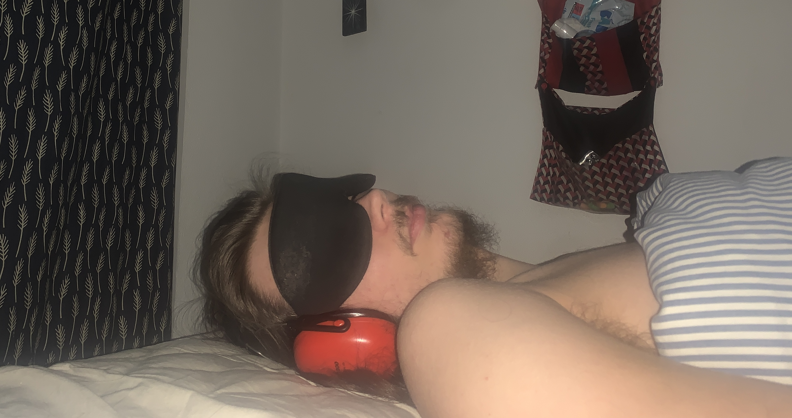

## About
Hi I'm Yann and I have very severe ME/CFS from a covid infection. I'm bedridden, unable to speak, unable to sit, and unable to tolerate others in my presence. This site is a collection of anything I wanted to share or compile in relation to ME/CFS and Long Covid. I hope the content here is useful. 

**Most Useful Page** 
* [ME/CFS Resources](useful-resources.md)

**Commonly Visited**
* [What is ME/CFS?](me-cfs.md)
* [ME/CFS resources](useful-resources.md)
* [How to Help (Advocacy Masterlist)](how-to-help.md)
* [ME News and Media](community-news.md)

**Recently Added Pages**
* [How to Help (Advocacy Masterlist)](how-to-help.md)
* [ME News](community-news.md)
* [Collection of Mainstream News about ME](me-inthenews.md)
* [ME/CFS resources](useful-resources.md)
* [Long Covid Action Project is Dangerous](LCAP.md)
* [What is ME/CFS?](me-cfs.md)

   

This image shows how I am 99% of the time. I have extensive sound and light proofing becaude my brain usually cannot process the stimuli of sound and light without using too much energy. I am lucky enough to (as of now) be able to occasionally use my phone. I have spent periods unable to interact with the world at all: only daydreaming, when my brain has enough energy to do so.

   

---

[Mainpage](https://me-cfs.github.io), [ME Resources](useful-resources.md), [Twitter](https://twitter.com/yann_mecfs)

